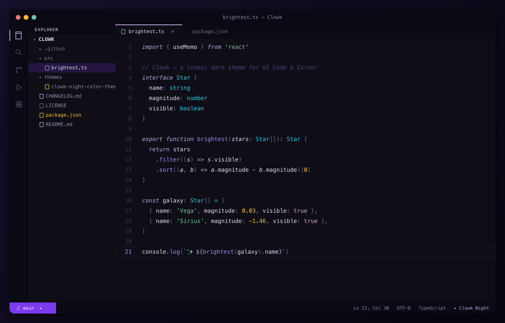

<div align="center">


# Clowk

**A cosmic dark theme for Visual Studio Code & Cursor — inspired by nebulae and galaxies.**

[](https://marketplace.visualstudio.com/items?itemName=thadeu.clowk-theme)
[](https://marketplace.visualstudio.com/items?itemName=thadeu.clowk-theme)
[](https://marketplace.visualstudio.com/items?itemName=thadeu.clowk-theme)
[](LICENSE)

</div>

<p align="center">
  
</p>

## ✨ Features

- **Deep cosmic background** (`#0f0e17`) that's easy on the eyes for long sessions.
- **Carefully tuned syntax colors** — a violet/cyan/green palette with warm yellow and pink accents, designed for clear contrast without harshness.
- **Semantic highlighting** enabled — colors follow your language server, not just regex scopes.
- **Broad language coverage**: JavaScript/TypeScript, JSX/TSX, HTML, CSS/SCSS, JSON, YAML, TOML, Markdown, Shell, Dockerfile, Makefile, Ruby, Python, Go and Rust.
- **Complete workbench theming**: activity bar, side bar, tabs, status bar, panels, terminal (16-color ANSI), peek view, diffs, git decorations, notifications and more.
- **Works in both VS Code and Cursor** (and any VS Code-compatible editor).
- **Part of the Clowk family** — **Clowk Night** (dark) is available now; **Clowk Day** (light) is on the roadmap.

## 📦 Installation

### From the editor (recommended)

1. Open the **Extensions** view (`Cmd/Ctrl + Shift + X`).
2. Search for **Clowk**.
3. Click **Install**.
4. Open the theme picker (`Cmd/Ctrl + K` then `Cmd/Ctrl + T`) and select **Clowk Night**.

### Quick Open

Press `Cmd/Ctrl + P` and run:

```
ext install thadeu.clowk-theme
```

### Cursor

Cursor uses the Open VSX registry. Search for **Clowk** in the Extensions
view, or install the published `.vsix` manually:

```
Extensions view → ··· menu → Install from VSIX…
```

### From source

```bash
git clone https://github.com/thadeu/clowk-theme.git
cd clowk-theme
pnpm install
pnpm run package        # produces clowk-theme-<version>.vsix
code --install-extension clowk-theme-*.vsix   # or: cursor --install-extension ...
```

Then select **Clowk Night** from the color theme picker.

## 🎨 Palette

| Role | Color | Hex |
| --- | --- | --- |
| Background |  | `#0f0e17` |
| Surface / chrome |  | `#0a0914` |
| Foreground |  | `#e0def4` |
| Comments |  | `#4a4680` |
| Keywords |  | `#c2a6e2` |
| Functions |  | `#a78bfa` |
| Accent |  | `#7c3aed` |
| Types / operators |  | `#22d3ee` |
| Strings |  | `#6ec89e` |
| Numbers / classes |  | `#fbbf24` |
| Constants / regex |  | `#e0a5c5` |
| Modifiers / CSS |  | `#7aafe0` |
| Tags / errors |  | `#f87171` |

## 💡 Recommended settings

For the cleanest look with Clowk, this pairs nicely:

```jsonc
{
  "editor.fontFamily": "'JetBrains Mono', 'SF Mono', Menlo, monospace",
  "editor.fontLigatures": true,
  "editor.lineHeight": 1.6,
  "editor.semanticHighlighting.enabled": true
}
```

## 🛠 Troubleshooting

### Colors look off, washed out or wrong (especially on a second Mac or an external display)

A color theme is just data — it renders the exact same hex values on every
machine. If Clowk looks different or "off" on one Mac, it's almost always the
**display color profile**, not the theme.

This happened on a second Mac where the display was set to the **"Color LCD"**
profile, which shifted the whole palette. Switching to a standard sRGB profile
fixed it instantly:

> **System Settings → Displays → Color Profile → `sRGB IEC61966-2.1`**
> (or your display's calibrated/standard profile)

Other things that change how the theme *looks* (none are the theme itself):

- **True Tone** and **Night Shift** warm up the whole screen — turn them off when comparing.
- `workbench.colorCustomizations` / `editor.tokenColorCustomizations` in your `settings.json` override theme colors.
- An outdated VS Code / Cursor ignores newer color keys and falls back to defaults — keep the editor updated.

## 🤝 Contributing

Contributions are welcome — see [CONTRIBUTING.md](CONTRIBUTING.md) for how to
run the theme locally and submit changes. Bug reports and ideas go in
[Issues](https://github.com/thadeu/clowk-theme/issues).

## 📄 License

[MIT](LICENSE) © Thadeu Esteves
